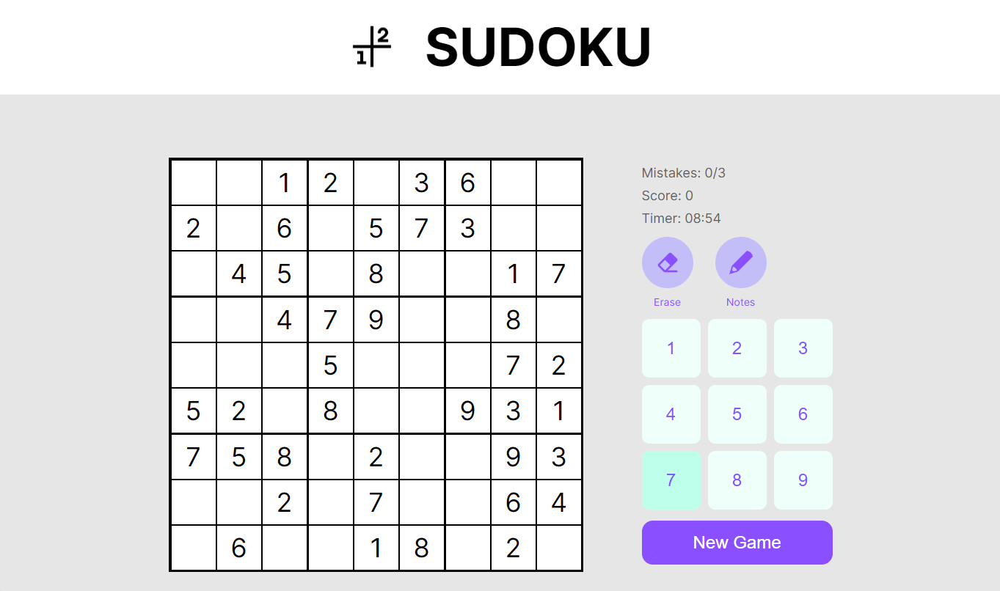
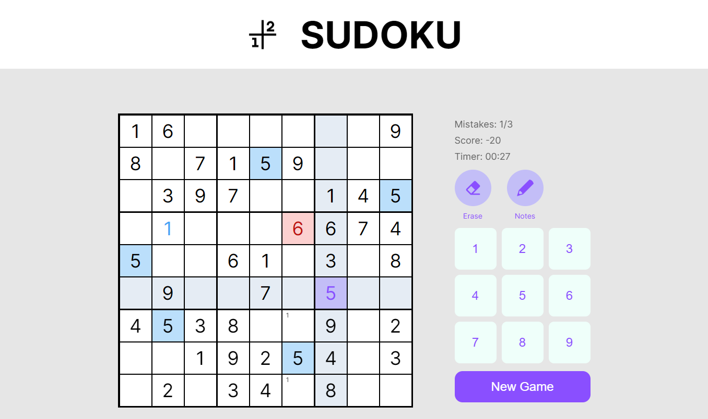
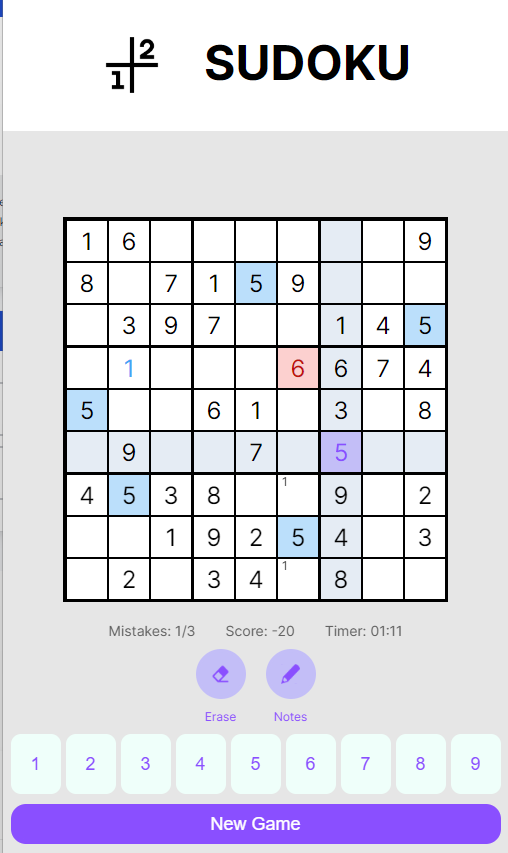

# Sudoku App

## Description
This Sudoku App project is created using React for the front-end. It includes a Sudoku generator to create new puzzles, a solver to solve existing puzzles, and a user interface to interact with the Sudoku game. The project also utilizes CSS for styling and layout.

## Website
[Link to Sudoku App](https://sudokuappzagrebelnio.netlify.app/)

## Screenshots

## Features
- Sudoku puzzle generation
- Sudoku puzzle solving
- User-friendly interface for playing Sudoku
- Responsive design for various screen sizes
- Stylish design using CSS

## Technologies Used
- React
- CSS